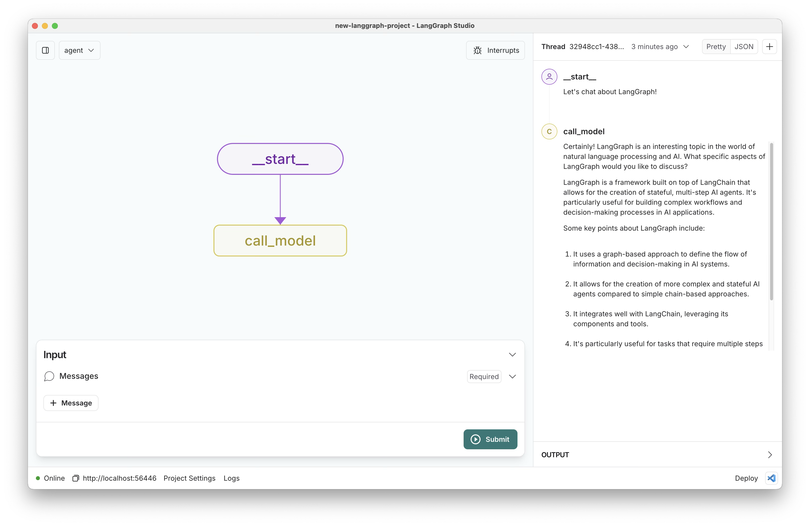

# New LangGraph Project

[](https://github.com/langchain-ai/new-langgraph-project/actions/workflows/unit-tests.yml)
[](https://github.com/langchain-ai/new-langgraph-project/actions/workflows/integration-tests.yml)
[![Open in - LangGraph Studio](https://img.shields.io/badge/Open_in-LangGraph_Studio-00324d.svg?logo=data:image/svg%2bxml;base64,PHN2ZyB4bWxucz0iaHR0cDovL3d3dy53My5vcmcvMjAwMC9zdmciIHdpZHRoPSI4NS4zMzMiIGhlaWdodD0iODUuMzMzIiB2ZXJzaW9uPSIxLjAiIHZpZXdCb3g9IjAgMCA2NCA2NCI+PHBhdGggZD0iTTEzIDcuOGMtNi4zIDMuMS03LjEgNi4zLTYuOCAyNS43LjQgMjQuNi4zIDI0LjUgMjUuOSAyNC41QzU3LjUgNTggNTggNTcuNSA1OCAzMi4zIDU4IDcuMyA1Ni43IDYgMzIgNmMtMTIuOCAwLTE2LjEuMy0xOSAxLjhtMzcuNiAxNi42YzIuOCAyLjggMy40IDQuMiAzLjQgNy42cy0uNiA0LjgtMy40IDcuNkw0Ny4yIDQzSDE2LjhsLTMuNC0zLjRjLTQuOC00LjgtNC44LTEwLjQgMC0xNS4ybDMuNC0zLjRoMzAuNHoiLz48cGF0aCBkPSJNMTguOSAyNS42Yy0xLjEgMS4zLTEgMS43LjQgMi41LjkuNiAxLjcgMS44IDEuNyAyLjcgMCAxIC43IDIuOCAxLjYgNC4xIDEuNCAxLjkgMS40IDIuNS4zIDMuMi0xIC42LS42LjkgMS40LjkgMS41IDAgMi43LS41IDIuNy0xIDAtLjYgMS4xLS44IDIuNi0uNGwyLjYuNy0xLjgtMi45Yy01LjktOS4zLTkuNC0xMi4zLTExLjUtOS44TTM5IDI2YzAgMS4xLS45IDIuNS0yIDMuMi0yLjQgMS41LTIuNiAzLjQtLjUgNC4yLjguMyAyIDEuNyAyLjUgMy4xLjYgMS41IDEuNCAyLjMgMiAyIDEuNS0uOSAxLjItMy41LS40LTMuNS0yLjEgMC0yLjgtMi44LS44LTMuMyAxLjYtLjQgMS42LS41IDAtLjYtMS4xLS4xLTEuNS0uNi0xLjItMS42LjctMS43IDMuMy0yLjEgMy41LS41LjEuNS4yIDEuNi4zIDIuMiAwIC43LjkgMS40IDEuOSAxLjYgMi4xLjQgMi4zLTIuMy4yLTMuMi0uOC0uMy0yLTEuNy0yLjUtMy4xLTEuMS0zLTMtMy4zLTMtLjUiLz48L3N2Zz4=)](https://langgraph-studio.vercel.app/templates/open?githubUrl=https://github.com/langchain-ai/new-langgraph-project)

This template demonstrates a simple chatbot implemented using [LangGraph](https://github.com/langchain-ai/langgraph), designed for [LangGraph Studio](https://github.com/langchain-ai/langgraph-studio). The chatbot maintains persistent chat memory, allowing for coherent conversations across multiple interactions.



The core logic, defined in `src/agent/graph.py`, showcases a straightforward chatbot that responds to user queries while maintaining context from previous messages.

## What it does

The simple chatbot:

1. Takes a user **message** as input
2. Maintains a history of the conversation
3. Generates a response based on the current message and conversation history
4. Updates the conversation history with the new interaction

This template provides a foundation that can be easily customized and extended to create more complex conversational agents.

## Getting Started

Assuming you have already [installed LangGraph Studio](https://github.com/langchain-ai/langgraph-studio?tab=readme-ov-file#download), to set up:

1. Create a `.env` file.

```bash
cp .env.example .env
```

2. Define required API keys in your `.env` file.

<!--
Setup instruction auto-generated by `langgraph template lock`. DO NOT EDIT MANUALLY.
-->


<!--
End setup instructions
-->

3. Customize the code as needed.
4. Open the folder in LangGraph Studio!

## How to customize

1. **Modify the system prompt**: The default system prompt is defined in [configuration.py](./src/agent/configuration.py). You can easily update this via configuration in the studio to change the chatbot's personality or behavior.
2. **Select a different model**: We default to Anthropic's Claude 3 Sonnet. You can select a compatible chat model using `provider/model-name` via configuration. Example: `openai/gpt-4-turbo-preview`.
3. **Extend the graph**: The core logic of the chatbot is defined in [graph.py](./src/agent/graph.py). You can modify this file to add new nodes, edges, or change the flow of the conversation.

You can also quickly extend this template by:

- Adding custom tools or functions to enhance the chatbot's capabilities.
- Implementing additional logic for handling specific types of user queries or tasks.
- Integrating external APIs or databases to provide more dynamic responses.

## Development

While iterating on your graph, you can edit past state and rerun your app from previous states to debug specific nodes. Local changes will be automatically applied via hot reload. Try experimenting with:

- Modifying the system prompt to give your chatbot a unique personality.
- Adding new nodes to the graph for more complex conversation flows.
- Implementing conditional logic to handle different types of user inputs.

Follow-up requests will be appended to the same thread. You can create an entirely new thread, clearing previous history, using the `+` button in the top right.

For more advanced features and examples, refer to the [LangGraph documentation](https://github.com/langchain-ai/langgraph). These resources can help you adapt this template for your specific use case and build more sophisticated conversational agents.

LangGraph Studio also integrates with [LangSmith](https://smith.langchain.com/) for more in-depth tracing and collaboration with teammates, allowing you to analyze and optimize your chatbot's performance.

<!--
Configuration auto-generated by `langgraph template lock`. DO NOT EDIT MANUALLY.
{
  "config_schemas": {
    "agent": {
      "type": "object",
      "properties": {}
    }
  }
}
-->

# CSV-to-Python-Code Generator

A LangGraph application that takes a CSV file and natural language question as input, and generates Python code to analyze the CSV data and answer the question. The application then automatically executes the code and returns the results.

## Features

- Processes CSV files with pandas
- Analyzes CSV data to extract metadata (columns, data types, etc.)
- Generates Python code tailored to answer specific questions about the data
- Automatically executes the generated code and displays results
- Supports data visualization with matplotlib
- Command-line interface for easy interaction

## Installation

1. Clone the repository
2. Create and activate a virtual environment:
   ```
   python -m venv .venv
   source .venv/bin/activate  # On Windows: .venv\Scripts\activate
   ```
3. Install the package:
   ```
   pip install -e .
   ```

## Configuration

Create a `.env` file in the project root with your API keys:

```
OPENAI_API_KEY=your_openai_api_key
OPENAI_API_BASE=your_openai_api_base  # Optional, defaults to OpenAI's base URL
```

## Usage

### Command Line Interface

```
python src/cli.py --csv path/to/your/data.csv --question "Your question about the data"
```

#### Options:

- `--csv`, `-c`: Path to the CSV file (required)
- `--question`, `-q`: Question to ask about the data (optional, will prompt if not provided)
- `--model`, `-m`: OpenAI model to use (default: "anthropic/claude-3.7-sonnet")
- `--temperature`, `-t`: Temperature for the LLM (default: 0.0)
- `--preview-rows`, `-p`: Number of rows to include in the preview (default: 5)
- `--show-code`, `-s`: Display the generated Python code in the output (optional)

### Example Usage

```
python src/cli.py --csv data/sales.csv --question "What are the top 5 products by revenue?"
```

## How It Works

1. **CSV Loading**: The application loads the CSV file and extracts metadata about the columns, data types, and sample values.
2. **Code Generation**: Using an LLM (Large Language Model), the application generates Python code tailored to answer the specific question about the data.
3. **Automatic Execution**: The generated code is automatically executed, and the results are displayed to the user.
4. **Visualization**: If the generated code includes data visualization, the figures are saved locally and their locations are displayed.

## Example Questions

- "What's the average temperature by month?"
- "Show me a bar chart of sales by region"
- "Find correlations between customer age and purchase amount"
- "What day of the week has the highest transaction volume?"
- "Create a scatter plot of height vs. weight"

## Contributing

Contributions are welcome! Please feel free to submit a Pull Request.

## License

This project is licensed under the MIT License - see the LICENSE file for details.